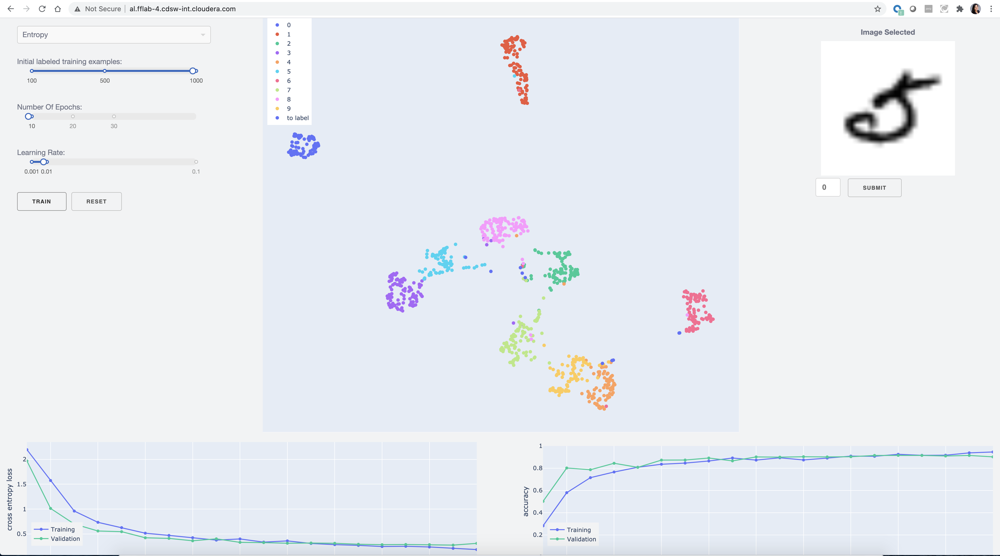

# Active Learning Workflow Demo

> Supervised machine learning, while powerful, needs labeled data to be
effective. Active learning reduces the number of labeled examples needed to
train a model, saving time and money while obtaining comparable performance to
models trained with much more data.   
> This application is meant to serve as a complement to the [prototype](https://activelearner.fastforwardlabs.com/) 
for the report we released on Learning with Limited Labeled Data. To build an 
intuition for why active learning works, please see our blogpost - 
[A guide to learning with limited labeled data](https://blog.cloudera.com/a-guide-to-learning-with-limited-labeled-data/) 



## What is Active Learning?

Active learning is an iterative process, and relies on human input to build up a
smartly labeled dataset. The process typically looks like this:

* Begin with a small set of labeled data (that is all we have)
* Train a model 
* Use the trained model to run inference on a much larger pool of unlabeled data 
available to us
* Use a selection strategy to pick out points that are difficult for the machine
* Request labels from human
* Add these back into the labeled datapool
* Repeat the training process and iterate

We use the MNIST dataset to illustrate the active learning workflow. To start, 
we train a convolutional neural network using only a few labeled datapoints. 
You can kick off training by selecting appropriate hyperparameters and clicking 
on the "TRAIN" button. Once the model has completed training, you can visualize 
the embeddings of the convolutional neural network by using UMAP to project the 
high dimensional representation down to 2D. 

## Structure

```
.
├── activelearning        # active learning scripts
├── apps                  # Dash application
├── assets                # Dash related stylesheets
├── cml                   # contains scripts that facilitate the project launch on CML.
├── data                  # contains MNIST data.
├── docs                  # images/ snapshots for README
├── experiments           # Contains a script that demonstrate the use of active learning functions
```

The `assets`, `data`, `docs`, and `experiments` directories are unimportant and 
can be ignored. 

### `activelearning`
```
activelearning
├── data.py
├── dataset.py
├── model.py
├── sample.py
└── train.py
```
- `data.py` loads train and validation data
- `dataset.py` MNIST dataset handler
- `model.py` Neural network architecture
- `sample.py` defines random, entropy and entropy dropout selection strategies
- `train.py` helper functions for model training, generating embeddings and predictions, computing metrics, checkpointing, saving results in text file and so on

### `apps` 
```
apps
├── app.py
├── demo.py 
├── demo_description.md
├── demo_intro.md
```
These scripts leverage the stylesheets from the `assets` folder provide a UI to:
- train a model based on the user selected hyperparameters,
- visualize the trained embeddings using UMAP, a dimension reductionality technique,
- visualize model performance metric son trains and validation sets
- and request labels for 10 selected datapoints from the user to retrain the model
- the final model is saved in the "./models" directory for future use

### `data`
```
data
├── MNIST
```
The project uses the [MNIST dataset](http://yann.lecun.com/exdb/mnist/) to illustrate 
the AL workflow. It uses only the 10k testing dataset as the entire dataset. 
- First set aside 2,000 datapoints for validation/testing
- Out of the remaining 8,000 datapoints, allow the user to select 100, 500 or 1,000 as 
initial labeled examples while the rest are unlabeled. 
- The user can then provide labels for the 10 shortlisted examples (based on the selection strategy) from the 
remaining training examples and continue to train a model with the additional data 
points. 
- In the long run the model performance differs based on the selection strategy employed.

## Using the App
To go from a fresh clone of the repo to the final state, follow these instructions in order.

### Installation
The code and applications within were developed against Python 3.6.9, and are likely also to function with more recent versions of Python. We relied on GPUs for much of the analysis and use a version of PyTorch optimized for CUDA 10.2. 

To install dependencies, first create and activate a new virtual environment through your preferred means, then pip install from the requirements file. I recommend:

```python
python3 -m venv .venv
source .venv/bin/activate
pip install -r requirements.txt
```

In CML or CDSW, no virtual env is necessary. Instead, inside a Python 3 session (with at least 2 vCPU / 4 GiB Memory), simply run

```python
!pip3 install -r requirements.txt     # notice `pip3`, not `pip`
```

#### As a normal python session
- First, uncomment the following lines in `app.py`
  ```
  # Uncomment the line below to run w/o CML or CDSW
  server = app.server
  
  # Running server
  if __name__ == '__main__':
    # Uncomment, if you are running locally vs CDSW / CML
    # app.run_server(port=os.getenv("CDSW_APP_PORT"))
    # OR for local
    app.run_server(debug=True)
  ```
- Run
  ```
  python app.py
  ```

#### Within CML or CDSW
- First, specify the port in app.py. 
  ```
  # Comment the line below to run w/o CML or CDSW
  # server = app.server
  
  # Running server
  if __name__ == '__main__':
    # Uncomment if you are running locally vs CDSW / CML
    app.run_server(port=os.getenv("CDSW_APP_PORT"))
    # OR for local
    # app.run_server(debug=True)
  ```
- Second, set the subdomain in CDSW's Applications tab.
- Third, enter app.py in the Script field in CDSW's Applications tab.
- Fourth, start the application within CDSW.
- Finally, access demo at `subdomain.ffl-4.cdsw.eng.cloudera.com`


### Launch the Application on CML
There are two ways to launch the NeuralQA prototype on CML:

1. **From Prototype Catalog** - Navigate to the Prototype Catalog on a CML workspace, select the "Active Learner" tile, click "Launch as Project", click "Configure Project"
2. **As ML Prototype** - In a CML workspace, click "New Project", add a Project Name, select "ML Prototype" as the Initial Setup option, copy in the [repo URL](https://github.com/fastforwardlabs/active-learning-cml), click "Create Project", click "Configure Project"

> Note: Active Learner depends on several heavy libraries (Pytorch, Dash, and so on). A minimum of 6GB memory instance is recommended to run this template.

## Acknowledgments
The UMAP configuration is inspired from the DASH [example applications](https://dash-gallery.plotly.host/Portal/)

## To Do
- Reset click should change or not display the "Training dataset has ... " examples
- clean-up

